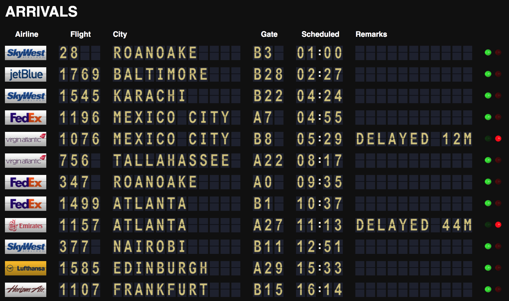

# Virtual Split-Flap Display



This is a simulation of a split-flap display (often called a Solari board) designed to run in a web browser. It dynamically loads JSON data from a data source and renders that data as characters and images on the board. Individual characters are animated using CSS sprites.

The look and feel are fully configurable by changing the markup and using different sprite images, and the included files are simply examples intended to get you started with your own project.

## Application Structure

`/public/js` - The client-side code is in `split-flap.js`. This code loads jquery, underscore and backbone from dnjs.cloudflare.com. You may wish to change this if your application will run disconnected.

`/public/img` - Image sprites. Customize these to change the look of the split flap elements or utilize different character sets or status indicators. I've included the .pxd file(s) so you can edit these in Pixelmator.

`/public/css` - The base styles for this application. These can be extended or overridden by adding your own in `/public/plugins`. Note how the `.full`, `.character` and `.number` definitions here define different (sub)sets of images on the character sprites. If you edit the character sprites you must also edit these classes to match.

`public/index.html` - Example HTML to render into the browser. This is where you define the layout of your board and define some basic constants.

`/public/plugins` - Custom Javascript, CSS and images. Use these as a starting point to connect to new data sources, change the look and feel, etc.

`/app.js` - A simple Node.js application to serve static files (HTML, Javascript, CSS and images) and to serve JSON data to populate the displays. If you already have a web/application server you might not need this file.

## Installation

```
git clone https://github.com/baspete/Split-Flap.git
cd Split-Flap
npm install
node app.js
```

Navigate to `http://locahost:8080` in your browser.

## Customization

The look and feel is customized by changing the markup, CSS and sprite images. Of course, any size changes you make to the images must be reflected in the sprite images and vice-versa.

The display refresh interval and the data source url are set in the `<script>` block at the bottom of the HTML pages. Make sure this interval is set long enough so that the entire display has finished rendering before starting again.

The row refresh cascade interval is set in the setTimeout() function in sf.chart.render(). Setting this too low results in a jerky animation as too many elements animate at once and slow your processor.

The individual elements' animation speed is set in the fadeIn() and fadeOut() functions in sf.chart.splitFlap.show()

## Data

The example Node app at `app.js` exposes an API route at `/api/arrivals` which demonstrates sending data to `split-flap.js`.

```
{
    data: [
        {
            airline: "JBU",
            flight: 541,
            city: "Durban",
            gate: "A20",
            scheduled: "0233",
            status: "A"
        },
        {
            airline: "SWA",
            flight: 1367,
            city: "Roanoake",
            gate: "B13",
            scheduled: "1416",
            status: "B",
            remarks: "Delayed 13M"
        },
        {
            airline: "JBU",
            flight: 1685,
            city: "Charleston",
            gate: "A18",
            scheduled: "0042",
            status: "A"
        }
    ]
}
```

The files in `/public/plugins` are used to set the URL for the data and process the results. See `/public/plugins/adsb/custom.js` for an example.
